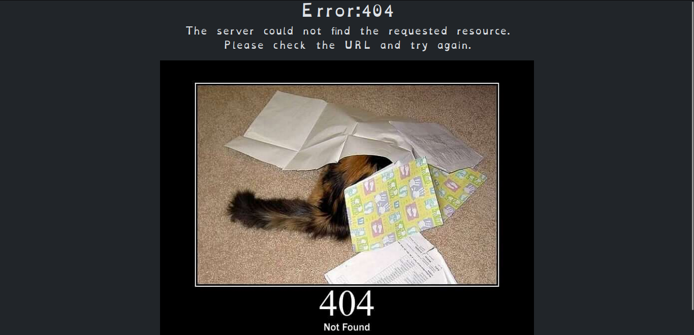

# cute-error-page
A simple PHP page that fetches cute cat pics for HTTP errors

## Demo

## What is this?
This is a simple PHP page that fetches cute cat pics for HTTP errors. It's a fun way to make your error pages more interesting. It's also a good way to keep your users entertained while you fix the problem.

## What are these `plesk-error-pages`?
These are replacement error pages for Plesk. They are designed to be used with Plesk's custom error pages feature. They automatically redirect it to the `error.php` page.